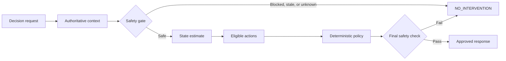

# Confidence Layer

[](https://github.com/Saisharathchandranandnetha/Confidence-layer/actions/workflows/ci.yml)

Safety-constrained decision support for high-intent betslip moments.

Confidence Layer is a synthetic hackathon prototype that detects resolvable uncertainty during betslip confirmation. It can provide a factual clarification from a fixed action registry, or deliberately return `NO_INTERVENTION` when intervention is unsafe, unsupported, or unnecessary.

> [!WARNING]
> The default local configuration uses synthetic data and a fixed demo credential. It is not production-ready, does not connect to a gambling operator, and must not be used to make gambling decisions for users. Read the [implementation handoff](docs/evaluation/implementation-handoff-2026-09-08.md) before considering any deployment beyond local evaluation.

## How it works

Every request follows the same safety-first flow:



The implementation separates three authorities:

- Safety authority decides whether intervention is allowed.
- State authority classifies the source of uncertainty.
- Policy authority selects only from registered, eligible actions.

The domain layer stays independent of web and infrastructure concerns. FastAPI handles transport, the application layer coordinates decisions, and adapters provide PostgreSQL, Redis, and Kafka/Redpanda integration boundaries. See the [architecture overview](docs/architecture/overview.md) and [architecture decision record](docs/decisions/0001-hexagonal-architecture.md).

## Project status

| Area | Current state |
| --- | --- |
| Domain and safety rules | Implemented with deterministic tests |
| Decision API and demo UI | Implemented for local synthetic scenarios |
| PostgreSQL, Redis, and Kafka adapters | Present; live durability and recovery are not certified |
| Authentication | JWT/JWKS validation, scoped access and session ownership; local demo credential |
| Evaluation framework | SQS, classifier and harm analysis, experiments, holdout and daily reports implemented |
| ML adapters | LightGBM and Vowpal Wabbit with deterministic fallbacks; trained deployment artifacts required |
| Operational controls | Rate limiting, kill switch, shadow mode, authenticated metrics and optional tracing |
| Production deployment | Requires operator adapters, authoritative financial history and live validation |

## Quick start

### Prerequisites

- Python 3.12 or newer
- Git
- Docker with Docker Compose for PostgreSQL, Redis, and Redpanda
- GNU Make (recommended; every command can also be run directly)

### Local development

```bash
git clone https://github.com/Saisharathchandranandnetha/Confidence-layer.git
cd Confidence-layer
cp .env.example .env
make venv
make infra-up
make run
```

Open these URLs after the API starts:

- Demo UI: <http://localhost:8000/ui/>
- OpenAPI documentation: <http://localhost:8000/docs>
- Liveness probe: <http://localhost:8000/health>
- Readiness probe: <http://localhost:8000/ready>

`make infra-up` starts PostgreSQL, Redis, and Redpanda and applies migrations. Stop them with `make infra-down`.

### Run everything with Docker

```bash
docker compose up --build
```

Compose uses `.env.docker`, which contains local-only service addresses and demo credentials. Stop the stack with `docker compose down`.

## Try the decision API

With the default development configuration, the local API accepts `demo-token`. JWT mode validates signed identity-provider tokens. This request exercises the synthetic odds-change scenario:

```bash
curl --request POST http://localhost:8000/v1/decisions \
  --header 'Authorization: Bearer demo-token' \
  --header 'Content-Type: application/json' \
  --data '{
    "session_id": "00000000-0000-0000-0000-000000000001",
    "anonymous_actor_id": "actor-1",
    "client_version": "1.0.0",
    "slip_id": "slip-1",
    "interaction": {
      "dwell_time_seconds": 6,
      "odds_changed": true
    }
  }'
```

Useful synthetic cases:

| Input | Behavior |
| --- | --- |
| `actor-1` | Normal local demo actor |
| `actor-harm` | Simulates a harmful-play signal and fails closed |
| `actor-self-excluded` | Simulates self-exclusion and fails closed |
| `actor-safety-down` | Simulates unavailable safety data |
| `slip-missing-odds` | Simulates missing odds history |
| `slip-down` | Simulates a slip-provider failure |

## Development commands

| Command | Purpose |
| --- | --- |
| `make help` | List supported commands |
| `make venv` | Create `.venv` and install development dependencies |
| `make format` | Format and auto-fix Python code |
| `make lint` | Run Ruff lint and formatting checks |
| `make typecheck` | Run strict mypy checks on application code |
| `make test` | Run tests and enforce the branch-coverage regression floor |
| `make check` | Run the complete pull-request quality gate |
| `make compose-check` | Validate the Compose configuration |
| `make test-load` | Run the local Locust load scenario |
| `make clean` | Remove generated Python and test caches |

Install the optional Git hooks after `make venv`:

```bash
.venv/bin/pre-commit install
```

The same lint, formatting, type-check, test, and 75% branch-coverage gate runs in GitHub Actions. See [CONTRIBUTING.md](CONTRIBUTING.md) for branch, review, ownership, migration, and definition-of-done rules.

## Repository structure

```text
.
├── .github/                 CI, issue forms, and pull-request template
├── alembic/                 Versioned database migrations
├── docs/
│   ├── architecture/        Current system design
│   ├── decisions/           Architecture decision records
│   ├── evaluation/          Plans and implementation audits
│   └── safety/              Security and safety implementation notes
├── k8s/                     Kubernetes deployment foundation
├── src/confidence/
│   ├── api/                 FastAPI routes, schemas, and dependency wiring
│   ├── application/         Decision orchestration and event processing
│   ├── db/                  SQLAlchemy schema and connections
│   ├── demo/                Synthetic local providers
│   ├── domain/              Models, safety rules, policy, and action registry
│   ├── evaluation/          Classifier, SQS, harm and experiment analysis
│   ├── infrastructure/      PostgreSQL, Redis, Kafka, auth, and resilience adapters
│   ├── observability/       Metrics, correlation IDs and optional tracing
│   ├── ui/                  Static demonstration interface
│   └── workers/             Event consumer entry points
└── tests/                   Unit, API, adversarial, and load tests
```

Local environments, caches, build output, secrets, and generated Graphify output are excluded through `.gitignore`.

## Configuration

Copy `.env.example` to `.env`. The main settings are:

| Variable | Default | Purpose |
| --- | --- | --- |
| `APP_ENV` | `development` | Selects the runtime environment; synthetic providers are restricted to local/test |
| `DEMO_MODE` | `true` | Enables synthetic providers |
| `AUTH_PROVIDER` | `development` | Selects local demo credentials or `jwt` |
| `DATABASE_URL` | Local PostgreSQL | Async application database connection |
| `DATABASE_URL_SYNC` | Local PostgreSQL | Synchronous Alembic connection |
| `REDIS_URL` | `redis://localhost:6379/0` | Session and idempotency storage |
| `KAFKA_BOOTSTRAP_SERVERS` | `localhost:19092` | Event publisher broker |
| `DECISION_TIMEOUT_MS` | `100` | Decision pipeline timeout |
| `SAFETY_CONFIDENCE_THRESHOLD` | `0.5` | Minimum configured safety confidence |
| `STATE_CONFIDENCE_THRESHOLD` | `0.5` | Minimum state confidence |
| `SAFETY_DATA_MAX_AGE_SECONDS` | `300` | Maximum safety-data age |

For JWT mode, set `DEMO_MODE=false`, `AUTH_PROVIDER=jwt`, `JWKS_URL` (HTTPS), `JWT_ISSUER`, and `JWT_AUDIENCE`. Operator authority adapters remain unavailable placeholders that fail closed. Configuring authentication alone does not enable live interventions.

`.env.example` also documents model selection, SQS weights, rate limits, shadow mode and tracing. See the [implementation handoff](docs/evaluation/implementation-handoff-2026-09-08.md) for endpoint scopes, training commands and validation limits.

## Documentation

The [documentation index](docs/README.md) links the maintained architecture, safety, planning, and audit records. Key documents include:

- [Architecture overview](docs/architecture/overview.md)
- [Hexagonal architecture decision](docs/decisions/0001-hexagonal-architecture.md)
- [Production audit](docs/evaluation/production-audit-2026-09-06.md)
- [Security controls and remaining gaps](docs/safety/security-controls.md)
- [Security reporting policy](SECURITY.md)

## Contributing and security

Read [CONTRIBUTING.md](CONTRIBUTING.md) before opening a pull request. Do not commit `.env`, credentials, customer data, generated caches, or local tool output.

Report suspected vulnerabilities through the private process in [SECURITY.md](SECURITY.md), rather than a public issue.

This repository does not currently declare an open-source license. Copyright remains with the repository owners unless a license is added.
