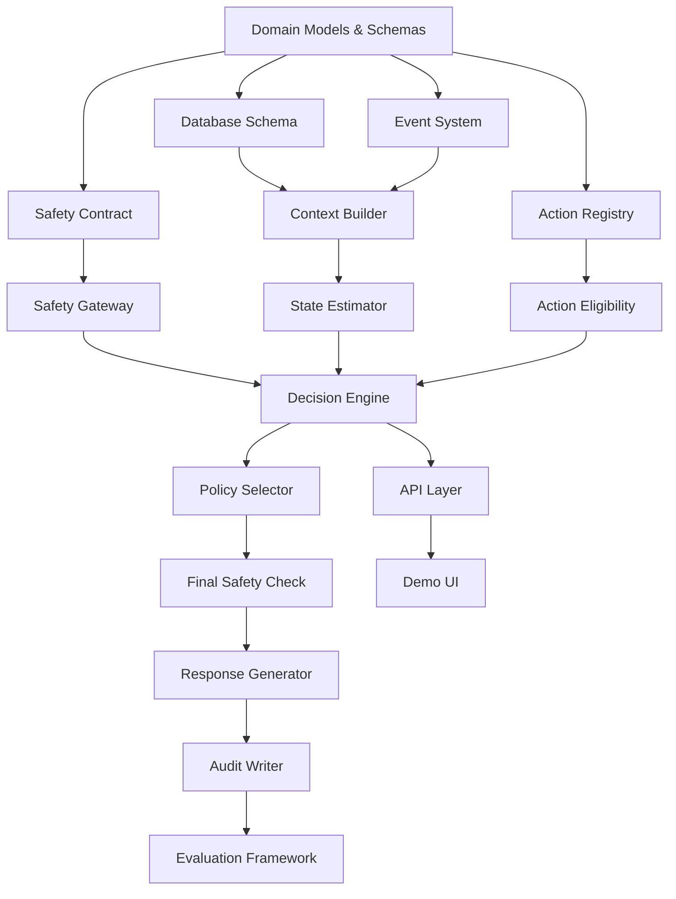

# Implementation Plan — Confidence Layer

**Date:** 2026-09-03
**Author:** Principal Engineer
**Status:** Approved for implementation

---

## Overview

```
EMPTY REPOSITORY
        ↓
ARCHITECTURE GAP: Everything
        ↓
DEPENDENCY GRAPH (below)
        ↓
PHASE 1: Foundation
        ↓
PHASE 2: Decision Engine
        ↓
PHASE 3: Demo
        ↓
PHASE 4: Evaluation
        ↓
PHASE 5: ML (stretch)
```

---

## Technology Stack

| Component | Technology | Justification |
|-----------|-----------|---------------|
| Language | Python 3.12+ | Rapid prototyping, ML ecosystem, type hints |
| Web framework | FastAPI | Async, schema validation via Pydantic, OpenAPI docs |
| Type system | Pydantic v2 | Domain object validation, serialization, versioning |
| Database | PostgreSQL 16 | ACID, foreign keys, JSONB for context, audit requirements |
| DB driver | asyncpg via SQLAlchemy async | Async PostgreSQL, connection pooling |
| Migrations | Alembic | Schema versioning, reproducible migrations |
| Testing | pytest + pytest-asyncio | Standard, fixtures, parametrize for scenarios |
| Observability | OpenTelemetry SDK | Vendor-neutral, structured metrics/traces |
| Logging | structlog | Structured JSON logging |
| Frontend | React + TypeScript | Typed, component model suits betslip UI |
| Containerization | Docker Compose | Local reproducible environment |
| Linting | ruff | Fast, comprehensive Python linter+formatter |
| Type checking | mypy (strict) | Catch type errors at build time |

### Explicitly NOT included (per architecture spec)
- Kafka, Redpanda, Redis, Kubernetes
- Vector database, RAG, LLM in decision path
- Online contextual bandit
- Microservice decomposition

---

## Dependency Graph



Build order follows topological sort of this graph.

---

## Phase 1 — Foundation

**Goal:** All domain contracts, schemas, database, and core infrastructure exist and validate.

**Duration target:** ~4 hours

### Deliverables

| # | Deliverable | Files |
|---|-------------|-------|
| 1.1 | Project scaffolding | `pyproject.toml`, `Makefile`, `.env.example`, `Dockerfile`, `docker-compose.yml` |
| 1.2 | Domain models (Pydantic) | `src/confidence/domain/models.py` |
| 1.3 | Enums and constants | `src/confidence/domain/enums.py` |
| 1.4 | Event schema | `src/confidence/domain/events.py` |
| 1.5 | Action Registry | `src/confidence/domain/actions.py` |
| 1.6 | Safety contract | `src/confidence/domain/safety.py` |
| 1.7 | Database schema | `src/confidence/db/schema.py`, `alembic/` |
| 1.8 | Configuration | `src/confidence/config.py` |
| 1.9 | Structured logging | `src/confidence/logging.py` |

### Acceptance Criteria
- [ ] All Pydantic models validate with strict mode
- [ ] mypy passes with strict config
- [ ] Database schema creates all required tables with FK constraints
- [ ] Action Registry contains 6 initial actions with full metadata
- [ ] Safety contract defines all S1–S17 invariants
- [ ] Docker Compose starts PostgreSQL
- [ ] `make test` runs (even if minimal tests)

---

## Phase 2 — Decision Engine

**Goal:** The full decision pipeline works with rule-based state estimation and all safety invariants enforced.

**Duration target:** ~6 hours

### Deliverables

| # | Deliverable | Files |
|---|-------------|-------|
| 2.1 | Context Builder | `src/confidence/engine/context.py` |
| 2.2 | Safety Gateway | `src/confidence/engine/safety.py` |
| 2.3 | State Estimator interface + rules impl | `src/confidence/engine/state.py` |
| 2.4 | Action Eligibility filter | `src/confidence/engine/eligibility.py` |
| 2.5 | Policy Selector | `src/confidence/engine/policy.py` |
| 2.6 | Final Safety Check | `src/confidence/engine/final_check.py` |
| 2.7 | Response Generator | `src/confidence/engine/response.py` |
| 2.8 | Decision Engine orchestrator | `src/confidence/engine/decision.py` |
| 2.9 | Audit Writer | `src/confidence/engine/audit.py` |
| 2.10 | API endpoints | `src/confidence/api/routes.py`, `src/confidence/api/schemas.py` |
| 2.11 | Safety invariant tests | `tests/test_safety_invariants.py` |
| 2.12 | State estimation tests | `tests/test_state_estimation.py` |
| 2.13 | Decision engine integration tests | `tests/test_decision_engine.py` |
| 2.14 | Scenario registry | `tests/scenarios/` |
| 2.15 | Failure mode tests | `tests/test_failures.py` |

### Acceptance Criteria
- [ ] All 17 safety invariants have passing automated tests
- [ ] All 10+ scenarios in the scenario registry pass
- [ ] Failure injection tests pass (DB failure, timeout, invalid data, etc.)
- [ ] NO_INTERVENTION is selected correctly in all required cases
- [ ] Policy cannot select unregistered actions
- [ ] API validates inputs and returns structured errors
- [ ] Full audit trail is written for every decision

---

## Phase 3 — Demo

**Goal:** Three scenarios work end-to-end with a visual betslip UI.

**Duration target:** ~4 hours

### Deliverables

| # | Deliverable | Files |
|---|-------------|-------|
| 3.1 | React project scaffolding | `frontend/` |
| 3.2 | Betslip component | `frontend/src/components/Betslip.tsx` |
| 3.3 | Intervention display | `frontend/src/components/Intervention.tsx` |
| 3.4 | Decision visualization | `frontend/src/components/DecisionViz.tsx` |
| 3.5 | Audit trail view | `frontend/src/components/AuditTrail.tsx` |
| 3.6 | Scenario selector | `frontend/src/components/ScenarioSelector.tsx` |
| 3.7 | Seed data for demo scenarios | `scripts/seed_demo.py` |
| 3.8 | E2E tests | `tests/test_e2e.py` |

### Acceptance Criteria
- [ ] Information uncertainty scenario: user sees odds-change explanation
- [ ] Legitimate reconsideration scenario: user sees NO intervention
- [ ] Harmful state scenario: intervention is blocked
- [ ] Decision reasoning is visible in the UI
- [ ] Audit trail is demonstrable in the UI

---

## Phase 4 — Evaluation

**Goal:** The system can quantify its own performance.

**Duration target:** ~3 hours

### Deliverables

| # | Deliverable | Files |
|---|-------------|-------|
| 4.1 | Scenario runner | `src/confidence/evaluation/runner.py` |
| 4.2 | Evaluation metrics | `src/confidence/evaluation/metrics.py` |
| 4.3 | Baseline comparison | `src/confidence/evaluation/baseline.py` |
| 4.4 | Regression suite | `tests/test_regression.py` |
| 4.5 | Evaluation report generator | `src/confidence/evaluation/report.py` |

### Acceptance Criteria
- [ ] Scenario runner executes all registered scenarios
- [ ] Metrics computed: intervention precision, no-intervention rate, safety block rate, state classification accuracy, latency
- [ ] Baseline (always NO_INTERVENTION) is compared against rule-based policy
- [ ] Regression suite is automated and reproducible

---

## Phase 5 — ML (Stretch)

**Goal:** ML model demonstrably improves over the deterministic baseline.

**Duration target:** ~4 hours (only if Phases 1–4 stable)

### Deliverables

| # | Deliverable | Files |
|---|-------------|-------|
| 5.1 | Synthetic training data generator | `src/confidence/ml/data.py` |
| 5.2 | LightGBM state estimator | `src/confidence/ml/lightgbm_estimator.py` |
| 5.3 | Model evaluation | `src/confidence/ml/evaluation.py` |
| 5.4 | Model versioning | `src/confidence/ml/versioning.py` |
| 5.5 | A/B comparison: rules vs. ML | `src/confidence/evaluation/ab_comparison.py` |

### Acceptance Criteria
- [ ] Model has explicit evaluation dataset
- [ ] Metrics are reported (accuracy, precision, recall per state)
- [ ] False-positive reconsideration rate is measured
- [ ] Model passes all safety invariant tests
- [ ] Model versioning is tracked in decisions

---

## Phases 6–8 (Post-hackathon)

These phases are documented for completeness but are **not in scope** for the hackathon MVP:

- **Phase 6:** Offline policy evaluation
- **Phase 7:** Shadow mode (learned policy records decisions without executing)
- **Phase 8:** Constrained contextual policy

---

## Project Structure

```
Confidence/
├── docs/
│   ├── architecture/
│   ├── decisions/
│   ├── safety/
│   ├── threat-model/
│   ├── evaluation/
│   ├── api/
│   └── runbooks/
├── src/
│   └── confidence/
│       ├── __init__.py
│       ├── config.py
│       ├── logging.py
│       ├── domain/
│       │   ├── __init__.py
│       │   ├── models.py
│       │   ├── enums.py
│       │   ├── events.py
│       │   ├── actions.py
│       │   └── safety.py
│       ├── db/
│       │   ├── __init__.py
│       │   ├── schema.py
│       │   ├── repository.py
│       │   └── migrations/
│       ├── engine/
│       │   ├── __init__.py
│       │   ├── context.py
│       │   ├── safety.py
│       │   ├── state.py
│       │   ├── eligibility.py
│       │   ├── policy.py
│       │   ├── final_check.py
│       │   ├── response.py
│       │   ├── decision.py
│       │   └── audit.py
│       ├── api/
│       │   ├── __init__.py
│       │   ├── app.py
│       │   ├── routes.py
│       │   └── schemas.py
│       ├── evaluation/
│       │   ├── __init__.py
│       │   ├── runner.py
│       │   ├── metrics.py
│       │   ├── baseline.py
│       │   └── report.py
│       └── ml/
│           ├── __init__.py
│           ├── data.py
│           ├── lightgbm_estimator.py
│           ├── evaluation.py
│           └── versioning.py
├── frontend/
│   ├── package.json
│   ├── src/
│   └── public/
├── tests/
│   ├── conftest.py
│   ├── test_domain.py
│   ├── test_safety_invariants.py
│   ├── test_state_estimation.py
│   ├── test_decision_engine.py
│   ├── test_api.py
│   ├── test_failures.py
│   ├── test_security.py
│   ├── test_e2e.py
│   ├── test_regression.py
│   └── scenarios/
│       ├── __init__.py
│       └── registry.py
├── scripts/
│   └── seed_demo.py
├── alembic/
├── docker-compose.yml
├── Dockerfile
├── Makefile
├── pyproject.toml
├── .env.example
├── .gitignore
└── README.md
```

---

## Risk Mitigation During Implementation

| Risk | Mitigation |
|------|-----------|
| Phase 2 taking too long | Safety invariant tests are the minimum bar; skip advanced scenarios |
| Database setup issues | Provide SQLite fallback for tests; Docker for full runs |
| Frontend blocking demo | Use a single-page static HTML fallback if React setup stalls |
| ML data unavailable | Phase 5 generates synthetic data; explicitly labeled as synthetic |
| Scope creep | Each phase has explicit acceptance criteria; no moving forward without them |

---

## Implementation Order Within Each Phase

Within each phase, build in dependency order:
1. Types and interfaces first
2. Pure domain logic second
3. Infrastructure adapters third
4. Tests alongside each component
5. Integration tests after all components exist
