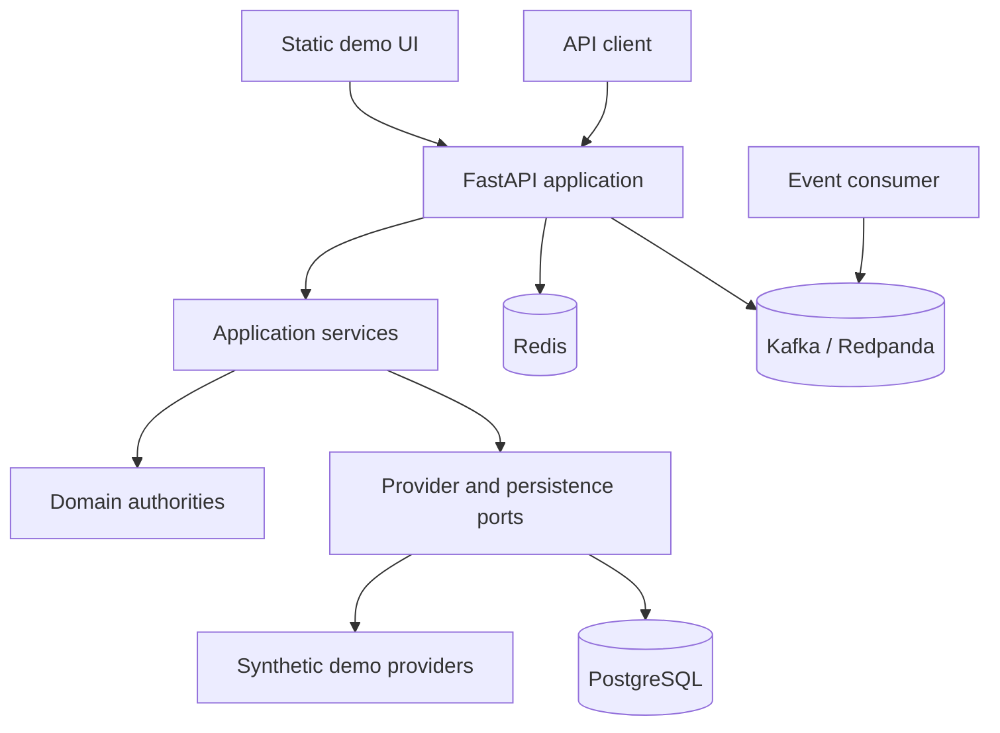
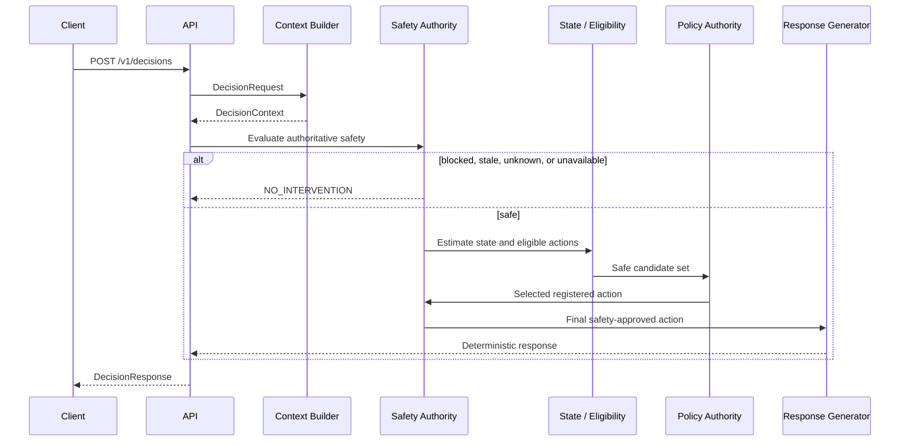

# Architecture overview

Confidence Layer is a modular Python application built around ports and adapters. The design keeps deterministic domain and safety rules separate from HTTP transport and external services.

## System context

The current API always wires synthetic safety, slip, and market providers. PostgreSQL, Redis, and Kafka adapters exist, but this repository does not contain real operator or identity-provider integrations.

## Layers

### Domain

`src/confidence/domain/` owns the business vocabulary and safety rules:

- Pydantic domain models and enumerations.
- Safety evaluation and fail-closed reasons.
- State estimation.
- Action registry and eligibility.
- Deterministic policy selection and response templates.
- Ports for external facts and persistence.

Domain code must not import API or infrastructure implementations.

### Application

`src/confidence/application/` coordinates use cases:

- `ContextBuilder` fetches safety, slip, and market facts through injected ports.
- `DecisionEngine` applies safety, state, eligibility, policy, final checks, response generation, and persistence scheduling.
- Event processing and replay boundaries live alongside the decision workflow.

The application layer depends on domain contracts. Infrastructure is injected at the composition boundary.

### API and UI

`src/confidence/api/` defines FastAPI schemas, routes, application lifecycle, and dependency wiring. Implemented public endpoints are:

| Method | Path | Purpose |
| --- | --- | --- |
| `POST` | `/v1/decisions` | Evaluate a synthetic betslip context |
| `POST` | `/v1/events` | Publish a client event |
| `GET` | `/health` | Process liveness |
| `GET` | `/ready` | Dependency readiness foundation |
| `GET` | `/docs` | OpenAPI interface |

`src/confidence/ui/` contains a static demonstration interface served at `/ui/`.

### Infrastructure

`src/confidence/infrastructure/` contains adapters for:

- PostgreSQL decision and audit persistence.
- Redis session and idempotency state.
- Kafka event publication and dead-letter handling.
- Development authentication.
- Resilience, ordering, and backpressure foundations.

Adapters are incomplete production foundations. The [production audit](../evaluation/production-audit-2026-09-06.md) records the evidence and remaining work for each boundary.

## Decision path

The core invariants are:

1. Safety is evaluated before policy selection can produce an external response.
2. Unknown, stale, invalid, or unavailable safety data fails closed.
3. `NO_INTERVENTION` is a registered first-class action and remains the fallback.
4. Policy output must be registered and belong to the eligible action set.
5. User-facing content comes from controlled templates and authoritative facts.

## Runtime composition

The FastAPI application composes the current runtime in `src/confidence/api/dependencies.py`:

- Synthetic providers supply local safety, slip, and market contexts.
- SQLAlchemy provides the persistence adapter.
- Redis provides idempotency storage.
- Kafka/Redpanda provides event publication.
- The application lifespan starts and stops the shared event publisher.

Application startup permits this composition only when `APP_ENV` is `development`, `local`, or `test`, `DEMO_MODE=true`, and `AUTH_PROVIDER=development`.

## Data and migrations

SQLAlchemy metadata lives in `src/confidence/db/schema.py`. Alembic revisions under `alembic/versions/` define the versioned PostgreSQL schema. Schema changes must be expressed in a new migration and checked against PostgreSQL for material behavior.

## Verification boundaries

The automated suite covers domain rules, engine behavior, API scenarios, schemas, Redis behavior through substitutes, resilience, contracts, and adversarial cases. These tests do not certify live PostgreSQL, Redis, or Kafka durability, production authorization, recovery behavior, or performance targets.

## Related records

- [ADR-001: Architecture](../decisions/0001-hexagonal-architecture.md)
- [Security implementation status](../safety/security-controls.md)
- [Production audit](../evaluation/production-audit-2026-09-06.md)
- [Contribution and review workflow](../../CONTRIBUTING.md)
